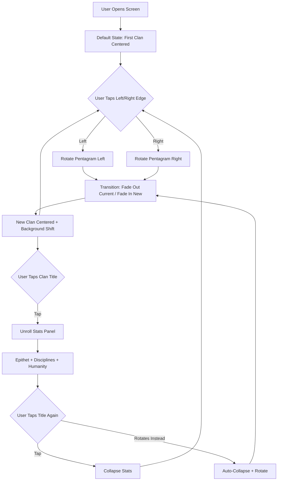

# Vampire Clan Select Screen

**AI 201 — Project 1: The "Hero Faction" Screen**  
**Instructor Demo Project | Spring 2026 | SCAD Atlanta**

---

## What This Is

A mobile-first clan selection screen inspired by Vampire: The Masquerade. Five vampire clans are arranged on a ritual pentagram viewed in forced perspective. One clan dominates the vertical screen space as a full silhouette. Tapping left or right rotates the pentagram, bringing the next clan to center. The silhouette *is* the UI.

This project is the instructor's demonstration build for AI 201, following the same assignment brief, deliverables, and ESF practices required of students. It exists to model the process — not just the output.

**Live URL:** *(will be added when deployed to GitHub Pages)*

---

## Design Intent

The full Design Intent was written before any AI-assisted coding began. It lives in the repository at:

📄 **[`.claude/design-intent.md`](.claude/design-intent.md)**

### Summary

- **Concept:** Ritual pentagram carousel. Vertical mobile layout. One silhouette dominates the screen. Adjacent clans recede at the edges in forced perspective.
- **Mood:** Candlelit sanctum. Dark, warm, ritualistic. Not horror — atmosphere.
- **Interaction:** Tap left/right edges to rotate. Tap the clan title to unroll stats (Disciplines, Humanity, Archetype tagline). No swipe (Android back gesture conflict).
- **The Five Clans:** Nosferatu (Monster), Brujah (Rebel), Malkavian (Visionary), Gangrel (Beast), Tremere (Sorcerer).
- **Non-negotiable:** The silhouette posture must communicate the archetype without any text. If you cover the title and can't tell which clan it is, the silhouette has failed.

### Production Pipeline (5 Passes)

| Pass | Focus | Target |
|------|-------|--------|
| 1 | Monochrome silhouettes | Posture, carousel, tap zones — grey only |
| 2 | Base colors | Per-clan palettes on background and pentagram |
| 3 | Pop highlights | Rim lighting, accent glows, contrast darkening |
| 4 | Feedback juice | Clan-specific animations, micro-interactions |
| 5 | Polish & post effects | Particulate, grain, final type refinement |

---

## AI Direction Log

### Entry 1 — *(date)*
**Asked:** *(what I asked AI to do)*  
**Produced:** *(what it gave me)*  
**Decision:** *(what I kept, changed, or rejected — and why)*

### Entry 2 — *(date)*
**Asked:**  
**Produced:**  
**Decision:**  

### Entry 3 — *(date)*
**Asked:**  
**Produced:**  
**Decision:**  

---

## Records of Resistance

### Resistance 1
**AI produced:**  
**I rejected/revised because:**  
**What I did instead:**  

### Resistance 2
**AI produced:**  
**I rejected/revised because:**  
**What I did instead:**  

### Resistance 3
**AI produced:**  
**I rejected/revised because:**  
**What I did instead:**  

---

## Five Questions Reflection

*(To be completed before final submission)*

1. **Can I defend this?**  
2. **Is this mine?**  
3. **Did I verify?**  
4. **Would I teach this?**  
5. **Is my documentation honest?**  

---

## Mermaid Diagram



---

## Tech Stack

- **React** (Vite) — Course-standard framework
- **CSS Grid + Flexbox** — Layout
- **SVG** — Hand-built silhouettes
- **CSS Transforms + Transitions** — Pentagram perspective, carousel rotation
- **GitHub Pages** — Deployment

## Running Locally

```bash
npm install
npm run dev
```

## Deploying to GitHub Pages

```bash
npm run build
# Push the dist/ folder to gh-pages branch, or configure GitHub Pages to deploy from Actions
```

---

## Disclosure

This project was built using AI-assisted coding (Claude CLI and claude.ai). The instructor directed all creative decisions, evaluated all AI output against the Design Intent, and documented the editorial process in the AI Direction Log and Records of Resistance above. The Design Intent was written entirely by the instructor before any AI coding began, per SCAD ESF Protocol.

---

*AI 201 Creative Computing with AI | Spring 2026 | SCAD Applied AI Degree Program*
