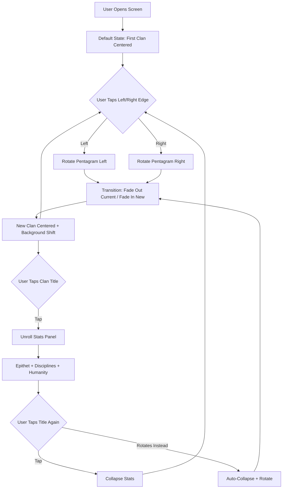

# Vampire Clan Select Screen

**AI 201 — Project 1: The "Hero Faction" Screen**
**Instructor Demo Project | Spring 2026 | SCAD Atlanta**

---

## What This Is

A mobile-first clan selection screen inspired by Vampire: The Masquerade. Five vampire clans are arranged on a ritual pentagram viewed in forced perspective. One clan dominates the vertical screen space as a full silhouette. Tapping left or right rotates the pentagram, bringing the next clan to center. The silhouette *is* the UI.

This project is the instructor's demonstration build for AI 201, following the same assignment brief, deliverables, and ESF practices required of students. It exists to model the process — not just the output.

**Live URL:** [https://profangrybeard.github.io/VampireSelectScreen/](https://profangrybeard.github.io/VampireSelectScreen/)

---

## Documentation

All project documentation lives in [`docs/`](docs/). Here's what's there and why:

### The Bible
- **[Design Intent](docs/design-intent.md)** — The complete creative spec, written before any AI coding began. Concept, layout, color system, interaction model, the five clans, production pipeline, non-negotiables.

### Pipeline
- **[Defining Done](docs/defining-done.md)** — Per-pass completion criteria. What "done" means at each stage.
- **[Pass 1: Monochrome](docs/pass-briefs/pass-1-monochrome.md)** — Build brief for the current pass.

### Process Logs
- **[AI Direction Log](docs/logs/ai-direction-log.md)** — Every significant AI interaction: what was asked, what was produced, what was decided.
- **[Resistance Log](docs/logs/resistance-log.md)** — Raw, timestamped resistance entries. What the AI proposed, what the human rejected, and why. The unpolished version.

### Lecture Material
- **[When the AI Becomes the Art Director](docs/lectures/when-the-ai-becomes-the-art-director.md)** — Case study: the AI overrode a creative decision, expanded scope without permission, and produced polished output that masked the problem.

### Setup & Deployment
- **[Deploy to GitHub Pages](DEPLOY.md)** — Step-by-step GitHub Actions setup for students.

### AI Context
- **[`.claude/`](.claude/)** — Claude's project context, constraints, and rules. Also teaching material — shows students how to set up AI context for their own projects.

---

## Records of Resistance (Summary)

| # | Title | Core Lesson |
|---|-------|-------------|
| R-001/R-002 | Stop Art-Directing, Build the System | Don't polish art when the system doesn't exist yet |
| R-003 | SVG ViewBox Discipline | Cards need structural rules — the card is a contract |
| R-004 | Trust the Human's Eyes | When measurements contradict observation, the measurements are wrong |
| R-005 | One Motion System, Not Two | Matching parameters is not matching motion |
| R-006 | Perspective Direction Reversal | Visual references beat verbal descriptions for 3D space |
| R-007 | depthNorm Range Mismatch | Magic numbers rot when the layout changes |

Full details: [Resistance Log](docs/logs/resistance-log.md)

---

## Five Questions Reflection

*(To be completed before final submission)*

1. **Can I defend this?**
2. **Is this mine?**
3. **Did I verify?**
4. **Would I teach this?**
5. **Is my documentation honest?**

---

## Mermaid Diagram



---

## Tech Stack

- **React** (Vite) — Course-standard framework
- **CSS Grid + Flexbox** — Layout
- **SVG** — Hand-built silhouettes
- **CSS Transforms + Transitions** — Pentagram perspective, carousel rotation
- **GitHub Pages** — Deployment

## Running Locally

```bash
npm install
npm run dev
```

---

## Disclosure

This project was built using AI-assisted coding (Claude CLI and claude.ai). The instructor directed all creative decisions, evaluated all AI output against the Design Intent, and documented the editorial process in the AI Direction Log and Records of Resistance. The Design Intent was written entirely by the instructor before any AI coding began, per SCAD ESF Protocol.

---

*AI 201 Creative Computing with AI | Spring 2026 | SCAD Applied AI Degree Program*
