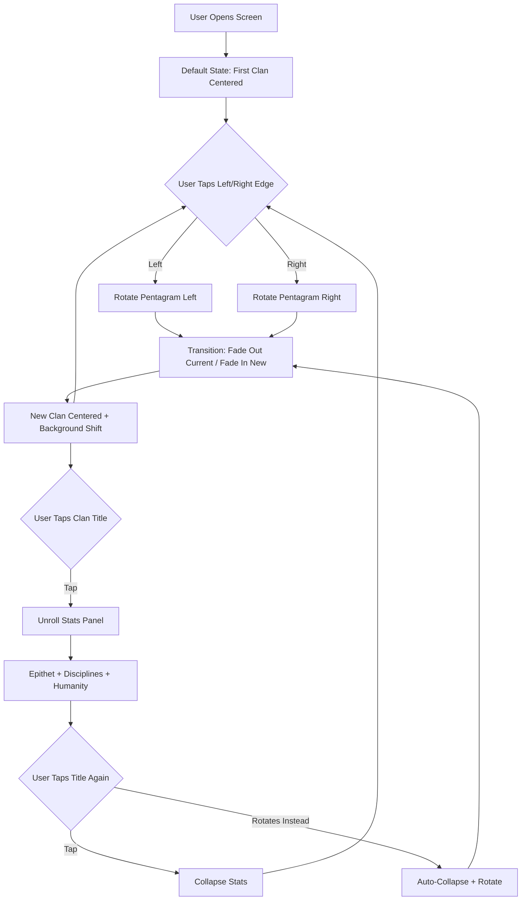

# Vampire Clan Select Screen

**AI 201 — Project 1: The "Hero Faction" Screen**  
**Instructor Demo Project | Spring 2026 | SCAD Atlanta**

---

## What This Is

A mobile-first clan selection screen inspired by Vampire: The Masquerade. Five vampire clans are arranged on a ritual pentagram viewed in forced perspective. One clan dominates the vertical screen space as a full silhouette. Tapping left or right rotates the pentagram, bringing the next clan to center. The silhouette *is* the UI.

This project is the instructor's demonstration build for AI 201, following the same assignment brief, deliverables, and ESF practices required of students. It exists to model the process — not just the output.

**Live URL:** *(will be added when deployed to GitHub Pages)*

---

## Design Intent

The full Design Intent was written before any AI-assisted coding began. It lives in the repository at:

📄 **[`.claude/design-intent.md`](.claude/design-intent.md)**

### Summary

- **Concept:** Ritual pentagram carousel. Vertical mobile layout. One silhouette dominates the screen. Adjacent clans recede at the edges in forced perspective.
- **Mood:** Candlelit sanctum. Dark, warm, ritualistic. Not horror — atmosphere.
- **Interaction:** Tap left/right edges to rotate. Tap the clan title to unroll stats (Disciplines, Humanity, Archetype tagline). No swipe (Android back gesture conflict).
- **The Five Clans:** Nosferatu (Monster), Brujah (Rebel), Malkavian (Visionary), Gangrel (Beast), Tremere (Sorcerer).
- **Non-negotiable:** The silhouette posture must communicate the archetype without any text. If you cover the title and can't tell which clan it is, the silhouette has failed.

### Production Pipeline (5 Passes)

| Pass | Focus | Target |
|------|-------|--------|
| 1 | Monochrome silhouettes | Posture, carousel, tap zones — grey only |
| 2 | Base colors | Per-clan palettes on background and pentagram |
| 3 | Pop highlights | Rim lighting, accent glows, contrast darkening |
| 4 | Feedback juice | Clan-specific animations, micro-interactions |
| 5 | Polish & post effects | Particulate, grain, final type refinement |

---

## AI Direction Log

### Entry 1 — 2026-03-22
**Asked:** Build a Nosferatu silhouette SVG and pentagram floor graphic with carousel rotation. Start with one silhouette at all 5 points to test the system.
**Produced:** Symmetrical vampire silhouette (wrong for Nosferatu), pentagram with 3D perspective tilt, tap-to-rotate carousel, anchor dots at pentagram tips.
**Decision:** Stopped art-directing the silhouette — adopted a generic placeholder shape. Prioritized the carousel system over silhouette fidelity. Pass 1 is about the system, not the art.

### Entry 2 — 2026-03-22
**Asked:** Anchor silhouettes to pentagram dots so they rotate together as one system. Fix feet-on-dot alignment.
**Produced:** Initially: two independent motion systems (CSS transitions for star, JS-calculated positions for silhouettes) that moved at different rates and paths. Feet floated 10% above dots for 6 iterations while AI reported "gap: 0%."
**Decision:** Rejected the dual-system approach. Demanded architectural redesign: one motion system where the pentagram CSS transition drives everything and silhouettes track dot positions via requestAnimationFrame. Fixed the foot gap by discovering `preserveAspectRatio` default was centering SVG content above the anchor point. (See R-004, R-005 in resistance log.)

### Entry 3 — 2026-03-22
**Asked:** Establish low camera angle with summoning circle floor. Front character dominant, back characters smaller and darker. Brightness and scale interpolation with depth.
**Produced:** Multiple iterations of tilt angle (35deg → 85deg → 75deg), perspective tuning, and container positioning. Initial "flatten" interpretation was backwards (made the floor look like a wall). depthNorm range was stale after layout changes, making brightness/z-index controls ineffective.
**Decision:** Settled on 75deg tilt, front scale 1.4x, back scale 0.625x, brightness range 80%-32%. Z-index layering puts clan title between front and back silhouettes for depth. Visual reference (Saving Private Ryan low-angle shot, character carousel GIF) resolved the perspective miscommunication. (See R-006, R-007 in resistance log.)

---

## Records of Resistance

### Resistance 1 — Stop Art-Directing, Build the System (R-002)
**AI produced:** 5 iterations of increasingly detailed Nosferatu posture refinements — hunched spine angles, bezier curves, arm asymmetry — while the carousel system didn't exist yet.
**I rejected/revised because:** The AI was solving the wrong problem at the wrong fidelity level. Pass 1 is about the interaction system, not silhouette polish. A rough shape that lets you test the carousel is more valuable than a perfect shape in a broken system.
**What I did instead:** Adopted a generic placeholder silhouette and redirected all effort to the pentagram floor graphic and rotation mechanics.

### Resistance 2 — Trust the Human's Eyes, Not Your Numbers (R-004)
**AI produced:** Six consecutive rounds of "fixes" to the foot-to-dot alignment, each time reporting "gap: 0.0%" from JavaScript measurements while screenshots clearly showed a 10% visual gap. The AI measured the invisible container box. The human measured the visible pixels.
**I rejected/revised because:** The AI's instrumentation was measuring the wrong thing. On a visual design project, the screen is the only truth. The AI should have questioned its own methodology after the first contradiction, not the sixth.
**What I did instead:** Forced the AI to investigate WHY its measurements contradicted reality. Root cause: SVG `preserveAspectRatio` default was centering content vertically inside the container. One attribute fix.

### Resistance 3 — One Motion System, Not Two (R-005)
**AI produced:** Two independent animation systems — CSS transitions for the pentagram rotation and JS-interpolated positions for the silhouettes. Even with matching duration and easing, a 3D rotation and a 2D linear interpolation produce fundamentally different motion curves.
**I rejected/revised because:** They looked like two unrelated animations playing simultaneously. The star spun; the characters slid. No amount of parameter tuning would fix a structural mismatch.
**What I did instead:** Demanded architectural redesign. The pentagram CSS transition is the single driver. Silhouettes track the actual rendered dot positions via requestAnimationFrame — no independent transitions, no timing to match.

### Resistance 4 — Perspective Direction Reversal (R-006)
**AI produced:** Reduced the pentagram tilt from 68deg to 35deg when asked to "flatten the floor," making it look like a wall instead of a ground plane.
**I rejected/revised because:** "Flatten" was ambiguous. A floor seen from a low angle needs MORE tilt (nearly horizontal plane seen edge-on), not less. Verbal descriptions of 3D space failed — a visual reference resolved it instantly.
**What I did instead:** Sent a Saving Private Ryan screenshot and a carousel GIF. Restored tilt to 75deg. The pentagram reads as a summoning circle on the ground with characters standing on it.

*Full resistance details with timeline and iteration feedback: [`.claude/resistance-log.md`](.claude/resistance-log.md)*

---

## Five Questions Reflection

*(To be completed before final submission)*

1. **Can I defend this?**  
2. **Is this mine?**  
3. **Did I verify?**  
4. **Would I teach this?**  
5. **Is my documentation honest?**  

---

## Mermaid Diagram



---

## Tech Stack

- **React** (Vite) — Course-standard framework
- **CSS Grid + Flexbox** — Layout
- **SVG** — Hand-built silhouettes
- **CSS Transforms + Transitions** — Pentagram perspective, carousel rotation
- **GitHub Pages** — Deployment

## Running Locally

```bash
npm install
npm run dev
```

## Deploying to GitHub Pages

```bash
npm run build
# Push the dist/ folder to gh-pages branch, or configure GitHub Pages to deploy from Actions
```

---

## Disclosure

This project was built using AI-assisted coding (Claude CLI and claude.ai). The instructor directed all creative decisions, evaluated all AI output against the Design Intent, and documented the editorial process in the AI Direction Log and Records of Resistance above. The Design Intent was written entirely by the instructor before any AI coding began, per SCAD ESF Protocol.

---

*AI 201 Creative Computing with AI | Spring 2026 | SCAD Applied AI Degree Program*
